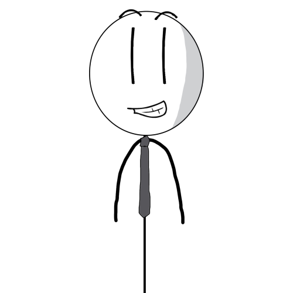

# [John Lang](https://sreitich.github.io/JohnLang/)

Millenia ago, there was a man. He awoke, unexpectantly, from an ancient slumber. His first words in this mysterious world in which he materialized: "Hello, World!" (he was quite the optimist). His name was John Language. And the first thing he did was create the world's first programming language: John Language.[^1 ] The second thing he did was create the Midwest.

As optimistic as he was, the great John Language™️ was not the inventive type (he would not invent creativity for another thousand years!); he's a simple man. Thus, John Language is not the most interesting language—quite mundane even. But, as John Language would tell you, "It'll get ya where you need to go!" Another common saying of John's was, "There's no stopping that neck once it gets going." Archaeologists, however, have yet to uncover what he meant by this.

###### Even though John Language is the original creator of John Lang, this *compiler* was created by [Adi Roitburg](https://github.com/Adiro777), [Allen Boyce](https://github.com/AllenBoyce),  [Jacob Mendoza](https://github.com/JacNslash04), [JD Elia](https://github.com/JD-Elia), [Kyle Matton](https://github.com/KyleMatton26), and [Sam Reitich](https://github.com/sreitich).

[^1]: John Language was retroactively renamed to John Lang by Oracle in 2020 following the devastating extinction of giraffes during the COVID-19 Pandemic.


## Features

* Statically typed!
* Real simple syntax. John Language is a simple man. Just git er done!
  * No silly parentheses around conditionals!
  * Assignment using colons!
  * Only one numeric type: the unbounded `handful`!
  * No complicated switches, ternaries, or enhanced for-loops!
* Some real nice data structures!
* Helpful directions. Those aren't error messages!
* Enthusiasm! Every lines ends with an exclamation point!
* Everything is public and accessible. No gatekeepin' here!

## Static Errors

* Type errors
* Declaration errors
* Function call errors
* Method call errors
* Return type errors
* Member access errors
* Mutability errors

## Example Programs

### Hello World

<table>
<tr> <th>John Lang</th><th>JavaScript</th><tr>
</tr>
<td>

```
letMeLearnYouSomething("Hello, world")!      
```

</td>
<td>

```javascript
console.log("Hello, world!");      
```

</td>
</table>

### Variable Declarations

<table>
<tr> <th>John Lang</th><th>JavaScript</th><tr>
</tr>
<td>

```
switcheroo x: youBetcha!
handful y: 2!
switcheroo isPositive: y >= 0!
chitchat message: "Eat the rich"!      
```

</td>
<td>

```javascript
let x = true;
let y = 2;
let isPositive = (y >= 0);
let chitchat = "Eat the rich";      
```

</td>
</table>

### Function Definitions

<table>
<tr> <th>John Lang</th><th>JavaScript</th><tr>
</tr>
<td>

```
gitErDone isEven(handful x): switcheroo {      
	betterGetGoin x % 2 == 0!
} 
```

</td>
<td>

```javascript
function isEven(x)  {
	return x % 2 == 0;      
}
```

</td>
</table>

### If-Statements

<table>
<tr> <th>John Lang</th><th>JavaScript</th><tr>
</tr>
<td>

```
ope x > 50 {
	betterGetGoin 2!      
} ope welp x > 25 {
	betterGetGoin 1!
} welp {
	betterGetGoin 0!
}
```

</td>
<td>

```javascript
if (x > 50) {
	return 2;
} else if (x > 25) {      
	return 1;
} else {
	return 0;
}
```

</td>
</table>

### Loops

<table>
<tr> <th>John Lang</th><th>JavaScript</th><tr>
</tr>
<td>

```
tilTheCowsComeHome handful x = 0, x < 10, x++ {      
	letMeLearnYouSomething(x)!
}
```

</td>
<td>

```javascript
for (var x = 0; x < 10; x++) {      
	console.log(x);
}
```

</td>
</table>

<table>
<tr> <th>John Lang</th><th>JavaScript</th><tr>
</tr>
<td>

```
holdMyBeer x < 10 {      
	x = x + 1!
}
```

</td>
<td>

```javascript
while (x < 10) {      
	x++;
}
```

</td>
</table>

### Class Definitions

<table>
<tr> <th>John Lang</th><th>JavaScript</th><tr>
</tr>
<td>

```
doohickey Rectangle {
	slapTogether(handful h, handful w) {      
		handful me.height: h!
		handful me.width: w!
	}
}
Rectangle r: whipUp Rectangle(4.0, 8.0)!
letMeLearnYouSomething(r.width)!
r.width: 5!
```

</td>
<td>

```javascript
class Rectangle {
	constructor(height, width) {      
		this.height = height;
		this.width = width;
	}
}
let r = new Rectangle(4.0, 8.0);
console.log(r.width);
r.width = 5.0;
```

</td>
</table>

### Data Structures

<table>
<tr> <th>John Lang</th><th>JavaScript</th><tr>
</tr>
<td>

```
todo fruits: ["apple", "banana"]!
almanac fruitPrices: { "apple": 2, "banana": 1 }!      
```

</td>
<td>

```javascript
let fruits = ["apple", "banana"];
let almanac = fruitPrices: { "apple": 2, "banana": 1 };      
```

</td>
</table>

### Errors

<table>
<tr> <th>John Lang</th><th>JavaScript</th><tr>
</tr>
<td>

```
whoopsieDaisy "Well, dontcha know, my muffler was actin' up the other day—musta been that darn weather, eh?—and my wife told me ta just go to a mechanic. But dontcha know, I told her, "Whoa, whoa, whoa. I can fix 'er!" Cause, ya know, all those mechanics will charge ya DOUBLE what it's gonna cost ya to fix it on yer own. And so I went down to the hardware store, but wouldn't ya know it, they were closed! So I turned around and went to my parents house (they don't get out much, eh? Ye know all this weather; they just weren't built for it, cause they moved up from down south in Florida, cause that's where my dad worked. Ya know, he moved there when he was forty years old, but by then the kids were outta the house and he and my mum had no problem setting down roots again. But they wanted to be closer to family after he retired so they came back up here to Wayzata, but, eh, wouldn't ya know it, they were used to all that warm weather down there in Florida!). And, just as luck would have it, my pops had a spare muffler in his garage (he was quite the handyman back in his day dontcha know), and he invited me in for a cawfee (you know we always take our cawfee black, eh), and we got to chit-chattin' about the kiddos, and it was real nice. But I had to get going, so I grabbed that muffler, drove on back home (the snow was comin' down like cats and dogs at that point), and fixed up ol' bessie's muffler in a jiffy."!
```

</td>
<td>

```javascript
throw "Well, dontcha know, my muffler was actin' up the other day—musta been that darn weather, eh?—and my wife told me ta just go to a mechanic. But dontcha know, I told her, "Whoa, whoa, whoa. I can fix 'er!" Cause, ya know, all those mechanics will charge ya DOUBLE what it's gonna cost ya to fix it on yer own. And so I went down to the hardware store, but wouldn't ya know it, they were closed! So I turned around and went to my parents house (they don't get out much, eh? Ye know all this weather; they just weren't built for it, cause they moved up from down south in Florida, cause that's where my dad worked. Ya know, he moved there when he was forty years old, but by then the kids were outta the house and he and my mum had no problem setting down roots again. But they wanted to be closer to family after he retired so they came back up here to Wayzata, but, eh, wouldn't ya know it, they were used to all that warm weather down there in Florida!). And, just as luck would have it, my pops had a spare muffler in his garage (he was quite the handyman back in his day dontcha know), and he invited me in for a cawfee (you know we always take our cawfee black, eh), and we got to chit-chattin' about the kiddos, and it was real nice. But I had to get going, so I grabbed that muffler, drove on back home (the snow was comin' down like cats and dogs at that point), and fixed up ol' bessie's muffler in a jiffy.";
```

</td>
</table>


## Types

| John Lang  | Acolytes           |
| ---------- | ------------------ |
| switcheroo | bool               |
| handful    | number (unbounded) |
| chitchat   | string             |


## Keyword Reference

### Conditionals

| John Lang     | Acolytes |
| ------------- | -------- |
| ope           | if       |
| ope welp      | else if  |
| welp          | else     |
| youBetcha     | true     |
| thinkAgainPal | false    |
| nah           | not/!    |

### Control Flow

| John Lang                 | Acolytes |
| ------------------------- | -------- |
| betterGetGoin             | return   |
| tilTheCowsComeHome        | for      |
| holdMyBeer                | while    |
| letsBlowThisPopsicleStand | break    |
| letsNotGetCarriedAway     | continue |

### Functions

| John Lang              | Acolytes |
| ---------------------- | -------- |
| gitErDone              | function |
| letMeLearnYouSomething | print    |

### Classes

| John Lang    | Acolytes    |
| ------------ | ----------- |
| doohickey    | class       |
| slapTogether | constructor |
| whipUp       | new         |
| me           | self        |

### Data Structures

| John Lang | Acolytes       |
| --------- | -------------- |
| todo      | list           |
| almanac   | dictionary/map |

### Error Handling

| John Lang     | Acolytes     |
| ------------- | ------------ |
| whenPigsFly   | check/assert |
| whoopsieDaisy | throw        |
